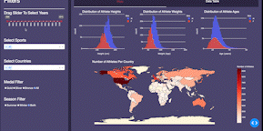

# Olympic Athletes Dashboard
## Welcome!

Welcome to the Olympic Athletes Dashboard app project repository!

This document (the README file) is a hub to give you some information about the project. Jump straight to one of the sections below, or just scroll down to find out more.

- [Olympic Athletes Dashboard](#olympic-athletes-dashboard)
  - [Welcome!](#welcome)
  - [What are we doing?](#what-are-we-doing)
    - [The problem](#the-problem)
    - [The solution](#the-solution)
  - [Demonstration](#demonstration)
  - [Who are we?](#who-are-we)
  - [What do we need?](#what-do-we-need)
  - [Installation](#installation)
  - [Get involved](#get-involved)
  - [Contact us](#contact-us)
  - [Thank you](#thank-you)

## What are we doing?

### The problem

* The olympics involve a large number of athletes from a variety of backgrounds with different personal attributes (heights, weights, ages). Olympic committees often need an objective reference tool to help in identifying talented individuals with regards to their heights, weights and ages for various sports and selecting the individuals with great potentials at an early point in order to bolster their olympic teams.
* It is not easy for decision makers to figure out which countries they should turn to when hiring the best possible coach or instructors to train their teams of different types of sports. 
* Young athletes often do not have a clear vision about their own strengths and weaknesses and the most suitable type of sports that fits their personal attributes.
* Members of the general public, who are enthusiastic about olympic sports, are often less accessible to the historical Olympic athletes data in an interactive way.


So, different groups of people have varied needs and usage scenarios when it comes to Olympic athletes data, and they often lack of a well-designed interactive dashboard to visualize the data.

### The solution

The  will:

* Present the distributions of Olympic athletes' personal attributes: ages, weights, heights. 
* Serve as an objective referencing tool for the Olypic committees to identify the potential individuals with suitable heights and weights.
* Allow user groups to customize diverse filters such as years, sports, seasons, and medals on the original dataset.
* Help young athletes to select the suitable type of sports that fits their personal attributes.
* Highlight the counts of athletes per country on an interactive world map based on the applied criteria.
* Initiated the visual comparisons between global countries for decision makers to identify the advantageous country to hire instructors for different sports.
* Provide an interactive tool that makes Olympic athletes data accessible and visible to the general public or any sports enthusiast.

Different groups of users will have the options to customize diverse filters and obtain insights from the Olympic Athletes data. The goal is to answer the personal attributes (ages, weights and heights) and the gloabl ditributions of the Olympic atheltes based on customized criteria. 

## Demonstration

Based on a dataset of approximately 270,000 Olympic Athletes, spanning from all Olympic Games between 1896 and 2016, this app aims to help you get some insight into Olympic Athletes. There are four charts: 3 histograms for the distribution of athletes' height, age, and weight, with two colors to distinguish genders, and a map demonstrating the number of athletes in different countries. When users mouse over the chart, tooltips with specific data appear. On the left-hand menu, four filters can be used here. A slider to select different years, two checkboxes for season and medals, and a dropdown menu to choose sports.


## Who are we?

The founders of the Olympic Athletes Dashboard app - [Xiaohan Chen][link_xiaohan], [Cuthbert Chow][link_cuthbert], [Jessie Wong][link_jessie] and [Luming Yang][link_luming] - are teammates from the Data Science graduate school at [University of British Columbia][]. 

The development of this app is mentored by the teaching team from the MDS program at the University of British Columbia. Check out the awesome program and teaching team on the [homepage][link_ubc_mds].

## What do we need?

**You**! In whatever way you can help.

We need expertise in data visualization, user experience design, and dashboard maintenance.

We'd love your feedback along the way either from a developer view or from a user experience perspective.

Our ultimate goal is to mitigate the misconceptions of the Olympic athletes and promote involvements from the general public to Olympic sports.

## Installation

1. You could install or clone the development version of Olympic Athletes Dashboard from GitHub to your local directory with the command below from the command line:

```
git clone https://github.com/UBC-MDS/Olympic_athletes_dashboard.git
```

2. You could setup a virtual enviroment using the commands below from the root of the cloned repository:

```
virtualenv olympic_athletes
source olympic_athletes/bin/activate
pip install -r requirements.txt
```

3. You could run the Olympic Athlete Dashboard app in the virtual environment on the local server using the command below from the root of this repository:

```
python src/app.py
```

4. You could view the webpage locally by navigating to the address http://127.0.0.1:8050/ in your browser.

## Get involved

If you think you can help in any of the areas listed above (and we bet you can) or in any of the many areas that we haven't yet thought of (and here we're *sure* you can) then please check out our [contributors' guidelines](CONTRIBUTING.md) and our [roadmap](../../issues/1).

Please note that it's very important to us that we maintain a positive and supportive environment for everyone who wants to participate. When you join us we ask that you follow our [code of conduct](CODE_OF_CONDUCT.md) in all interactions both on and offline.

## Contact us

If you want to report a problem or suggest an enhancement we'd love for you to [open an issue](../../issues) at this github repository because then we can get right on it.


## Thank you

Thank you so much for visiting the Olympic Athletes Dashboard and we hope that you enjoy the journay of exploring the Olympic Athletes data.


[link_xiaohan]: https://github.com/Anthea98
[link_cuthbert]: https://github.com/cuthchow
[link_jessie]: https://github.com/jessie14
[link_luming]: https://github.com/Luming-ubc
[link_ubc_mds]: https://masterdatascience.ubc.ca/
